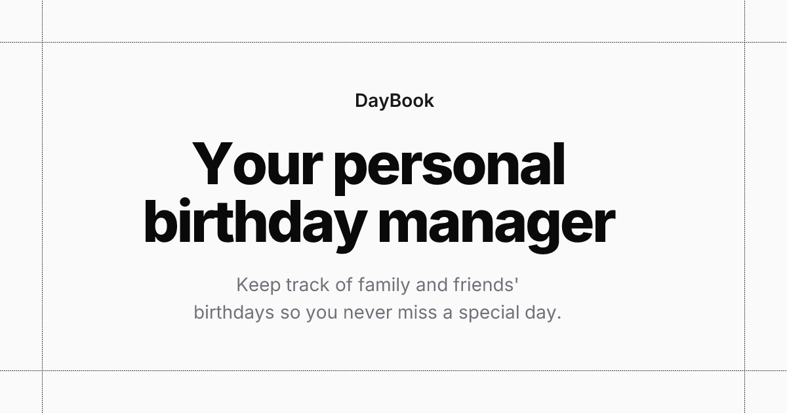

# DayBook

<div align="center">
  
</div>

## Overview

**DayBook** is a stylish, lightweight, local-first app designed to help you remember the people you love by keeping track of their birthdays, relationships, and special notes. 🎉🎂

🔗 **Try it now**: [day-book-app.vercel.app](https://day-book-app.vercel.app)

---

## Features

- 🔒 **Privacy First**: All your birthday, relationship, and settings data stays on your device (`IndexedDB` and `localStorage`). Vercel Analytics handles fully anonymized basic usage insights.
- 📱 **Installable PWA**: Install DayBook on your phone or desktop! Works offline, loads instantly, and detects updates in the background. It also includes specific iOS installation instructions and real-time offline status notifications.
- ✨ **Beautiful Dashboard**: Celebratory "Happy Birthday" section with confetti, upcoming birthdays list, and an interactive 12-month calendar grid.
- 🎨 **Rich Customization**:
  - 🌓 Theme toggling (Light/Dark).
  - 🅰️ Main greeting typography and gradient styling.
  - 💬 Floating messages and personalized greeting pools.
  - 🖼️ Two integrated avatar systems (`avvvatars` and `boring-avatars`) plus custom photo uploads optimized as WebP images.
- 🎵 **Sound & UI Feedback**: Satisfying, configurable audio feedback for interactions using `cuelume`, and delightful, gooey notification toasts via `goey-toast`.
- 📅 **Calendar & External Integration**: Import/Export your birthdays via `.ics` or `JSON` format. Large imports are handled effortlessly through an advanced virtualized preview interface, allowing for duplicate review and selection without freezing.
- 💾 **Storage Protection**: Keep your data safe with a dedicated Storage Overview section that lets you monitor usage and easily enable Persistent Storage protection.
- 🔗 **Birthday Links**: Request your friends' birthdays effortlessly! Generate an invitation link, send it via chat, and process their response link directly into your local database. No backend required.
- 🏷️ **Centralized Branding**: Easily fork and rebrand the application by editing a single `app-info.ts` configuration file that syncs across PWA manifests, meta tags, and all UI components.
- 🖼️ **Dynamic Social Previews**: Vercel Edge-powered dynamic Open Graph images tailored specifically for the Invitation and Response shareable links.
- ♿ **Highly Accessible**: Fully audited and optimized with robust semantic HTML and comprehensive ARIA screen-reader support.
- ℹ️ **Product Overview**: A dedicated `/about` page detailing the app's features and an interactive changelog. It features a responsive "Line Nav" table of contents built with Framer Motion.
- 📊 **Analytics**: Native Vercel Analytics and Speed Insights for basic usage and performance telemetry. _(See Privacy Disclaimer below)._

## Privacy & Data Disclaimer

DayBook is strictly a **local-first** application. Your birthday records, relationship tags, and personalized settings are stored entirely on your device via IndexedDB and `localStorage`. We do not sync your personal data to any external cloud database.

To improve the application, we use Vercel Analytics and Speed Insights for basic performance and usage tracking. This data is completely anonymized by Vercel, and no Personally Identifiable Information (PII) is ever stored or tracked.

## Technology Stack

- ⚡ **Framework**: React 19 + Vite 6
- 📱 **PWA**: vite-plugin-pwa + Workbox
- 📘 **Language**: TypeScript
- 🎨 **Styling**: Tailwind CSS 4
- 🐻 **State Management**: Zustand 5
- 🛣️ **Routing**: React Router v7
- 🧱 **UI Components**: Radix UI (via shadcn/ui)
- ✨ **Animation & Feedback**: Framer Motion, `@animate-ui`, `goey-toast`
- 🚀 **Performance**: `@tanstack/react-virtual`
- ✅ **Validation**: Zod + React Hook Form
- 🧪 **Testing**: Vitest
- 🔗 **URL State**: `nuqs`

## AI Agent Documentation

If you are an AI agent or a developer looking to contribute to this project, please consult the project documentation in the following order:

1. **`AGENTS.md`**: Permanent AI operating instructions and deep architectural context.
2. **`CURRENT_STATE.md`**: Living snapshot of what is actually implemented _right now_, known tech debt, and current focus.
3. **`PENDING_CHANGES.md`**: Development record containing unreleased product changes that have not yet been promoted to the official changelog.
4. **`docs/rules.md`**: Strict coding conventions, naming rules, and boundaries.
5. **`docs/instructions.md`**: The original foundational product specification.
6. **`docs/brand-guidelines.md`**: Design, typography, and personality rules.

## Local Development

### Prerequisites

- Node.js (v18+)
- npm

### Setup

```bash
# Clone the repository
git clone https://github.com/nmrisrl11/day-book-app.git

# Install dependencies
npm install

# Start the development server
npm run dev
```

## Available Scripts

- `npm run dev` - Starts the Vite development server.
- `npm run build` - Builds the app for production.
- `npm run test` - Runs the Vitest test suite.
- `npm run lint` - Lints the codebase using Oxlint.
- `npm run preview` - Previews the production build locally.
